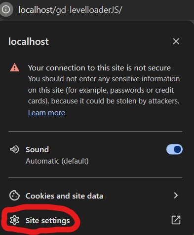
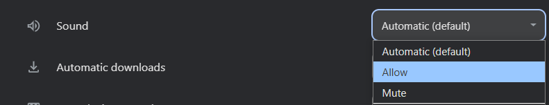

[](https://www.gnu.org/licenses/gpl-3.0.en.html)


###### this is an old project that I am just now modifying to put on github, we will probably not be able to fix any issues you have with the site. Most of this code is from a long time ago and it is very unorganized and inefficient, and I cannot guarantee that it will work on all devices. You have been warned.

# Geometry Dash Level Loader

A very laggy mess, but a recreation of Geometry Dash, made in pure Javascript, HTML, and CSS. So far, we have a (mostly) functioning cube gamemode, and a partially working ship gamemode, along with a really broken ball gamemode.

## Well, how can I make a level?
You can use GDColon's [Spreadsheet Editor](https://gdcolon.com/gdsheet), and paste your level data into the Level Viewer (through the editor button on the title screen). Then you can paste the level data in as a variable in one of the existing javascript files, which should look something like this:

```
var test = "kS38,1_255_2_0_3_0_4_-1_6_1000_7_1|1_255_2_153_3_0_4_-1_6_1001_7_1|1_255_2_255_3_0_4_-1_6_1009_7_1|1_255_2_255_3_255_4_-1_6_1004_7_1|1_255_2_255_3_255_4_-1_6_1002_7_1|,kA13,0,kA15,0,kA16,0,kA14,,kA6,5,kA7,7,kA17,1,kA18,0,kS39,0,kA2,0,kA3,0,kA8,0,kA4,0,kA9,0,kA10,0,kA11,0;1,1,2,19845,3,1305;1,1,2,19875,3,1305;1,1,2,19905,3,1305;1,1,2,19935,3,1305;1,1,2,19965,3,1305;1,1,2,19995,3,1305;1,1,2,20025,3,1305;1,1,2,20055,3,1305;1,1,2,20085,3,1305;1,1,2,20115,3,1305;1,1,2,20145,3,1305;1,1,2,20175,3,1305;1,1,2,19845,3,1275;1,1,2,19875,3,1275;1,1,2,19905,3,1275;1,1,2,19935,3,1275;1,1,2,19965,3,1275;1,1,2,19995,3,1275;1,1,2,20025,3,1275;1,1,2,20055,3,1275;1,1,2,20085,3,1275;1,1,2,20115,3,1275;1,1,2,20145,3,1275;1,1,2,20175,3,1275;1,1,2,19845,3,1245;1,1,2,19875,3,1245;1,1,2,19905,3,1245;1,1,2,19935,3,1245;1,1,2,19965,3,1245;1,1,2,19995,3,1245;1,1,2,20025,3,1245;1,1,2,20055,3,1245;1,1,2,20085,3,1245;1,1,2,20115,3,1245;1,1,2,20145,3,1245;1,1,2,20175,3,1245;1,1,2,19845,3,1215;1,1,2,19875,3,1215;1,1,2,19905,3,1215;1,1,2,19935,3,1215;1,1,2,19965,3,1215;1,1,2,19995,3,1215;1,1,2,20025,3,1215;1,1,2,20055,3,1215;1,1,2,20085,3,1215;1,1,2,20115,3,1215;1,1,2,20145,3,1215;1,1,2,20175,3,1215;1,1,2,19845,3,1185;1,1,2,19875,3,1185;1,1,2,19905,3,1185;1,1,2,19935,3,1185;1,1,2,19965,3,1185;1,1,2,19995,3,1185;1,1,2,20025,3,1185;1,1,2,20055,3,1185;1,1,2,20085,3,1185;1,1,2,20115,3,1185;1,1,2,20145,3,1185;1,1,2,20175,3,1185;1,1,2,19845,3,1155;1,1,2,19875,3,1155;1,1,2,19905,3,1155;1,1,2,19935,3,1155;1,1,2,19965,3,1155;1,1,2,19995,3,1155;1,1,2,20025,3,1155;1,1,2,20055,3,1155;1,1,2,20085,3,1155;1,1,2,20115,3,1155;1,1,2,20145,3,1155;1,1,2,20175,3,1155;1,1,2,19845,3,1125;1,1,2,19875,3,1125;1,1,2,19905,3,1125;1,1,2,19935,3,1125;1,1,2,19965,3,1125;1,1,2,19995,3,1125;1,1,2,20025,3,1125;1,1,2,20055,3,1125;1,1,2,20085,3,1125;1,1,2,20115,3,1125;1,1,2,20145,3,1125;1,1,2,20175,3,1125;1,1,2,19845,3,1095;1,1,2,19875,3,1095;1,1,2,19905,3,1095;1,1,2,19935,3,1095;1,1,2,19965,3,1095;1,1,2,19995,3,1095;1,1,2,20025,3,1095;1,1,2,20055,3,1095;1,1,2,20085,3,1095;1,1,2,20115,3,1095;1,1,2,20145,3,1095;1,1,2,20175,3,1095;1,1,2,19845,3,1065;1,1,2,19875,3,1065;1,1,2,19905,3,1065;1,1,2,19935,3,1065;1,1,2,19965,3,1065;1,1,2,19995,3,1065;1,1,2,20025,3,1065;1,1,2,20055,3,1065;1,1,2,20085,3,1065;1,1,2,20115,3,1065;1,1,2,20145,3,1065;1,1,2,20175,3,1065;1,1,2,19845,3,1035;1,1,2,19875,3,1035;1,1,2,19905,3,1035;1,1,2,19935,3,1035;1,1,2,19965,3,1035;1,1,2,19995,3,1035;1,1,2,20025,3,1035;1,1,2,20055,3,1035;1,1,2,20085,3,1035;1,1,2,20115,3,1035;1,1,2,20145,3,1035;1,1,2,20175,3,1035;1,1,2,19845,3,1005;1,1,2,19875,3,1005;1,1,2,19905,3,1005;1,1,2,19935,3,1005;1,1,2,19965,3,1005;1,1,2,19995,3,1005;1,1,2,20025,3,1005;1,1,2,20055,3,1005;1,1,2,20085,3,1005;1,1,2,20115,3,1005;1,1,2,20145,3,1005;1,1,2,20175,3,1005;1,1,2,19845,3,975;1,1,2,19875,3,975;1,1,2,19905,3,975;1,1,2,19935,3,975;1,1,2,19965,3,975;1,1,2,19995,3,975;1,1,2,20025,3,975;1,1,2,20055,3,975;1,1,2,20085,3,975;1,1,2,20115,3,975;1,1,2,20145,3,975;1,1,2,20175,3,975;1,1,2,495,3,465;1,1,2,525,3,465;1,1,2,555,3,465;1,1,2,585,3,465;1,1,2,615,3,465;1,1,2,645,3,465;1,1,2,675,3,465;1,1,2,705,3,465;1,1,2,735,3,465;1,1,2,765,3,465;1,1,2,795,3,465;1,1,2,825,3,465;1,1,2,855,3,465;1,1,2,885,3,465;1,1,2,915,3,465;1,1,2,945,3,465;1,1,2,975,3,465;1,1,2,1005,3,465;1,1,2,1035,3,465;1,1,2,1065,3,465;1,1,2,1095,3,465;1,1,2,1125,3,465;1,1,2,1155,3,465;1,1,2,1185,3,465;1,1,2,1215,3,465;1,1,2,1245,3,465;1,1,2,1275,3,465;1,1,2,1305,3,465;1,1,2,1335,3,465;1,1,2,1365,3,465;1,1,2,1395,3,465;1,1,2,1425,3,465;1,1,2,1455,3,465;1,1,2,1485,3,465;1,1,2,1515,3,465;1,1,2,1545,3,465;1,1,2,1575,3,465;1,1,2,1605,3,465;1,1,2,1635,3,465;1,1,2,1665,3,465;1,1,2,1695,3,465;1,1,2,1725,3,465;1,1,2,1755,3,465;1,1,2,1785,3,465;1,1,2,1815,3,465;1,1,2,1845,3,465;1,1,2,1875,3,465;1,1,2,1905,3,465;1,1,2,1935,3,465;1,1,2,1965,3,465;1,1,2,1995,3,465;1,1,2,2025,3,465;1,1,2,2055,3,465;1,1,2,2085,3,465;1,1,2,2115,3,465;1,1,2,2145,3,465;1,1,2,2175,3,465;1,1,2,2205,3,465;1,1,2,2235,3,465;1,1,2,2265,3,465;1,1,2,2295,3,465;1,1,2,2325,3,465;1,1,2,2355,3,465;1,1,2,2385,3,465;1,1,2,2415,3,465;1,1,2,2445,3,465;1,1,2,2475,3,465;1,1,2,2505,3,465;1,1,2,2535,3,465;1,1,2,2565,3,465;1,1,2,2595,3,465;1,1,2,2625,3,465;1,1,2,2655,3,465;1,1,2,2685,3,465;1,1,2,2715,3,465;1,1,2,2745,3,465;1,1,2,2775,3,465;1,1,2,2805,3,465;1,1,2,2835,3,465;1,1,2,2865,3,465;1,1,2,2895,3,465;1,1,2,2925,3,465;1,1,2,2955,3,465;1,1,2,2985,3,465;1,1,2,3015,3,465;1,1,2,3045,3,465;1,1,2,3075,3,465;1,1,2,3105,3,465;1,1,2,3135,3,465;1,1,2,3165,3,465;1,1,2,3195,3,465;1,1,2,3225,3,465;1,1,2,3255,3,465;1,1,2,3285,3,465;1,1,2,3315,3,465;1,1,2,3345,3,465;1,1,2,3375,3,465;1,1,2,3405,3,465;1,1,2,3435,3,465;1,1,2,3465,3,465;1,1,2,3495,3,465;1,1,2,3525,3,465;1,1,2,3555,3,465;1,1,2,3585,3,465;1,1,2,3615,3,465;1,1,2,495,3,435;1,1,2,525,3,435;1,1,2,555,3,435;1,1,2,585,3,435;1,1,2,615,3,435;1,1,2,645,3,435;1,1,2,675,3,435;1,1,2,705,3,435;1,1,2,735,3,435;1,1,2,765,3,435;1,1,2,795,3,435;1,1,2,825,3,435;1,1,2,855,3,435;1,1,2,885,3,435;1,1,2,915,3,435;1,1,2,945,3,435;1,1,2,975,3,435;1,1,2,1005,3,435;1,1,2,1035,3,435;1,1,2,1065,3,435;1,1,2,1095,3,435;1,1,2,1125,3,435;1,1,2,1155,3,435;1,1,2,1185,3,435;1,1,2,1215,3,435;1,1,2,1245,3,435;1,1,2,1275,3,435;1,1,2,1305,3,435;1,1,2,1335,3,435;1,1,2,1365,3,435;1,1,2,1395,3,435;1,1,2,1425,3,435;1,1,2,1455,3,435;1,1,2,1485,3,435;1,1,2,1515,3,435;1,1,2,1545,3,435;1,1,2,1575,3,435;1,1,2,1605,3,435;1,1,2,1635,3,435;1,1,2,1665,3,435;1,1,2,1695,3,435;1,1,2,1725,3,435;1,1,2,1755,3,435;1,1,2,1785,3,435;1,1,2,1815,3,435;1,1,2,1845,3,435;1,1,2,1875,3,435;1,1,2,1905,3,435;1,1,2,1935,3,435;1,1,2,1965,3,435;1,1,2,1995,3,435;1,1,2,2025,3,435;1,1,2,2055,3,435;1,1,2,2085,3,435;1,1,2,2115,3,435;1,1,2,2145,3,435;1,1,2,2175,3,435;1,1,2,2205,3,435;1,1,2,2235,3,435;1,1,2,2265,3,435;1,1,2,2295,3,435;1,1,2,2325,3,435;1,1,2,2355,3,435;1,1,2,2385,3,435;1,1,2,2415,3,435;1,1,2,2445,3,435;1,1,2,2475,3,435;1,1,2,2505,3,435;1,1,2,2535,3,435;1,1,2,2565,3,435;1,1,2,2595,3,435;1,1,2,2625,3,435;1,1,2,2655,3,435;1,1,2,2685,3,435;1,1,2,2715,3,435;1,1,2,2745,3,435;1,1,2,2775,3,435;1,1,2,2805,3,435;1,1,2,2835,3,435;1,1,2,2865,3,435;1,1,2,2895,3,435;1,1,2,2925,3,435;1,1,2,2955,3,435;1,1,2,2985,3,435;1,1,2,3015,3,435;1,1,2,3045,3,435;1,1,2,3075,3,435;1,1,2,3105,3,435;1,1,2,3135,3,435;1,1,2,3165,3,435;1,1,2,3195,3,435;1,1,2,3225,3,435;1,1,2,3255,3,435;1,1,2,3285,3,435;1,1,2,3315,3,435;1,1,2,3345,3,435;1,1,2,3375,3,435;1,1,2,3405,3,435;1,1,2,3435,3,435;1,1,2,3465,3,435;1,1,2,3495,3,435;1,1,2,3525,3,435;1,1,2,3555,3,435;1,1,2,3585,3,435;1,1,2,3615,3,435;1,10,2,825,3,375;1,8,2,1275,3,405,6,180;1,8,2,1575,3,405,6,180;1,67,2,2265,3,418,6,180;1,1,2,19875,3,345;1,1,2,20025,3,345;1,1,2,20145,3,345;1,36,2,855,3,315;1,1,2,19875,3,315;1,1,2,20025,3,315;1,10,2,3675,3,255;1,1,2,19875,3,285;1,1,2,20025,3,285;1,1,2,20145,3,285;1,1,2,19875,3,255;1,1,2,20025,3,255;1,1,2,20145,3,255;1,1,2,19875,3,225;1,1,2,20025,3,225;1,1,2,20145,3,225;1,1,2,19875,3,195;1,1,2,20025,3,195;1,1,2,20145,3,195;1,11,2,495,3,135;1,1329,2,765,3,165;1,1329,2,1005,3,165;1,1329,2,1335,3,165;1,1,2,19875,3,165;1,1,2,19905,3,165;1,1,2,19935,3,165;1,1,2,19965,3,165;1,1,2,19995,3,165;1,1,2,20025,3,165;1,1,2,20145,3,165;1,1,2,19875,3,135;1,1,2,20025,3,135;1,1,2,20145,3,135;1,1,2,19875,3,105;1,1,2,20025,3,105;1,1,2,20145,3,105;1,1,2,285,3,75;1,1,2,315,3,75;1,1,2,345,3,75;1,1,2,375,3,75;1,1,2,405,3,75;1,1,2,435,3,75;1,1,2,465,3,75;1,13,2,495,3,45;1,47,2,2325,3,45;1,1,2,19875,3,75;1,1,2,20025,3,75;1,1,2,20145,3,75;1,36,2,225,3,45;1,1333,2,1935,3,45;1,141,2,2085,3,45;1,84,2,2235,3,45;1,1,2,19875,3,45;1,1,2,20025,3,45;1,1,2,20145,3,45;1,35,2,855,3,2;1,1332,2,1185,3,2;1,140,2,1515,3,2;1,67,2,1725,3,2;1,1,2,19875,3,15;1,1,2,20025,3,15;1,1,2,20145,3,15;"
```
The example loads in my testing level for messing with the orbs, portals, gravity, pads, etc. (keep in mind that this will be a VERY long variable.)

After you view your level and put the data in a Javascript file, if you want to play it you have to duplicate one of the HTML files in the "LevelHTMLS" Directory, and name it whatever you want. then in your newly duplicated HTML file, change the ``` LevelData ``` variable to the name of the variable you created in the other javascript file, for example:

```
<!-- Grabbing our levels here-->
<script src="../javascript/funlevels.js" ></script>
<script src="../javascript/levels.js" ></script>
<script src="../javascript/testlevels.js" ></script>
<script src="../javascript/blockPresets.js" ></script>
<script>
    let levelData = DebugLevel;
</script>
<script src="../javascript/ActualLoader.js"></script>
```

Make sure that your level has over 100 objects in it, because otherwise the site will just lag out a lot, and then crash.

I will probably make a built in custom level player eventually, but its not a top priority so you have to git clone this repo to actually play your custom levels. You cant just download the zip file because otherwise none of the images work, which I assume is because I am using [git-lfs](https://git-lfs.com/) to handle all the images I have here

## What is wrong with this thing!??!
Well, a lot. I helped make this with [BlockHead66](https://github.com/Blockhead66), when we had a lot less knowledge of Javascript and CSS, so I made some dumb mistakes and just ignored things that could have been WAY more efficient. I also have to individually grab each image file from a spritesheet (using GDColon's [Spritesheet Splitter](https://gdcolon.com/gdsplitter/)) so not every block and their functions are in the site.

## Why are Back On Track and other levels impossible?!?!!
sorry about that, I pulled the level data from GD (using GDColon's [Save Explorer](https://gdcolon.com/gdsave/)), and I cant change the data easily. Paired with the fact that you will teleport up any blocks you would think you'd crash into, in Back On Tracks's case, you teleport straight into a spike. These spikes do indeed make you have to restart the level.

## What should I do to avoid lag or full crashes?
Well maybe dont play this if you're looking for a smooth experience, but I have a little list of things to avoid.

- Hitting the ground in upside down ship gamemode will crash the site (It tries to teleport to the bottom of it, but since it is the floor it would have to go infinitly, which it tries to do, and then crashes the site). this crash is also known as "dissapointment.jpg" which I recreated in real GD for my github pfp.

- When making a level, make sure it has over 100 objects or else the site will begin to lag out and eventually stop running.

- Try not to load a level with too many objects (over maybe 10k), each one is an ```  ``` HTML element, and too many will lag out the site (if you check funlevels.js in the javascript folder you will see that I tried).

- Using the ball gamemode at all is very risky and a similar thing that happens with upside down ship will happen if you try to use the weird glitchy swingcopter ball gamemode that we somehow made.

# No music?

yeah, sorry about that. but there is some menu music! to allow it, you have to enable automatic audio playing on the site, which looks something like this:

## Firefox


## Chrome
### (it doesnt usually show the slider in the first image, I already had enabled it though)


### then scroll down until you see this


## Edge

### I am not opening Edge for this, sorry Edge users
